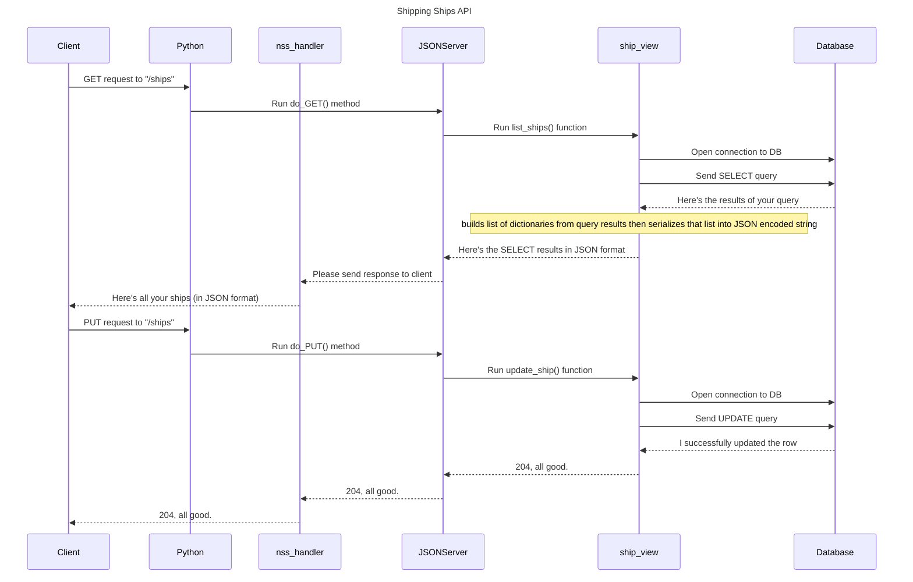

```mermaid
sequenceDiagram
        title Shipping Ships API

    participant Client
    participant Python
    participant nss_handler
    participant JSONServer
    participant ship_view
    participant Database
    Client->>Python:GET request to "/ships"
    Python->>JSONServer:Run do_GET() method
    JSONServer ->> ship_view: Run list_ships() function
    ship_view->>Database: Open connection to DB
    ship_view->>Database: Send SELECT query
    Database-->>ship_view: Here's the results of your query
    note over ship_view: builds list of dictionaries from query results then serializes that list into JSON encoded string
    ship_view-->>JSONServer: Here's the SELECT results in JSON format
    JSONServer -->> nss_handler: Please send response to client
    nss_handler-->>Client: Here's all your ships (in JSON format)
    Client->>Python: PUT request to "/ships"
    Python ->>JSONServer:Run do_PUT() method
    JSONServer ->> ship_view: Run update_ship() function
    ship_view ->> Database: Open connection to DB
    ship_view->> Database: Send UPDATE query
    Database-->>ship_view: I successfully updated the row 
    ship_view -->>JSONServer:204, all good.
    JSONServer-->> nss_handler: 204, all good.
    nss_handler -->> Client: 204, all good.
```